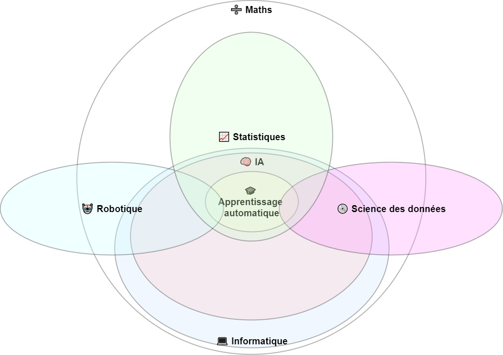

# Crea Code Club IA
## Partie 1: Identifier l'IA

---

[//]: # (--------------- Introduction)

# Programme du cours
1. Applications pratique de l'IA
2. Taxonomie
3. AI forte et AI faible

---

# Qu'est qu'une IA pour vous ?

--- 

[//]: # (--------------- Applications Pratique)

<!-- 
_backgroundColor: '#3588d1' 
_color: '#f8f8ff' 
-->

# Applications pratique de l'IA

---

<!-- _class: content-recommandation -->

- 

- 

- 

- 

- 

- 

- 

- 

---

# Sondage

- Parmis ces platerformes, lesquels utilisez-vous ?
- Connaissez-vous d'autre systèmes que ceux-la ?

---

# IA ou ne pas IA, tel est la question
**But**
*Apprendre à distinguer les système utilisant l'IA de ceux qui ne l'utilise pas*

**Description de l'exercice**
L'exercice comprend une liste de système, brièvement décrit et illustré avec une image ou 2 images maximum. A coté de chaque système figure 3 cases à cocher: IA, Pas IA, Non-déterminable.

**Moyen**
- Par groupe de 4
- 15 min

---

[//]: # (--------------- Taxonomie)

<!-- 
_backgroundColor: '#3588d1' 
_color: '#f8f8ff' 
-->

# Taxonomie

---

# Mots clefs
🧠 AI
🎓 Apprentissage automatique (Machine Learning)
💻 Informatique
➗ Maths
🤖 Robotique
💿 Science des données
📈 Statistiques

---

---

# Tâche impossible
**But**
*Apprendre à classifier une tâche selon le domaine de compétence nécessaire. L'exercice est orienté sur le domaine de l'IA*

**Description de l'exercice**
L'exercice comprend une liste de tâche et diagramme d'Euler avec des lettres. Les étudiants doivent faire correspondre les lettres avec les tâches.

**Moyen**
- Par groupe de 2
- 15 min

---

[//]: # (--------------- AI forte et AI faible)

<!-- 
_backgroundColor: '#3588d1' 
_color: '#f8f8ff' 
-->

# AI forte et AI faible

---

# AI forte et AI faible: quel est la différence ?

["Pourquoi une Intelligence Artificielle ne peut faire un Opéra ?"](https://www.youtube.com/embed/Orsse_gEJA0)

---

# A vous de classifier !

- [Vidéo 1](https://www.youtube.com/embed/BA9UC_3Ykqw)
- [Vidéo 2](https://www.youtube.com/embed/y3RIHnK0_NE)
- [Vidéo 3](https://www.youtube.com/embed/T4q0WS0gxRY)
- [Vidéo 4](https://www.youtube.com/embed/rVlhMGQgDkY)
- [Vidéo 5](https://www.youtube.com/embedXPtVZ69lomk)

<!--stackedit_data:
eyJoaXN0b3J5IjpbLTU1Mzk2NTgxOV19
-->