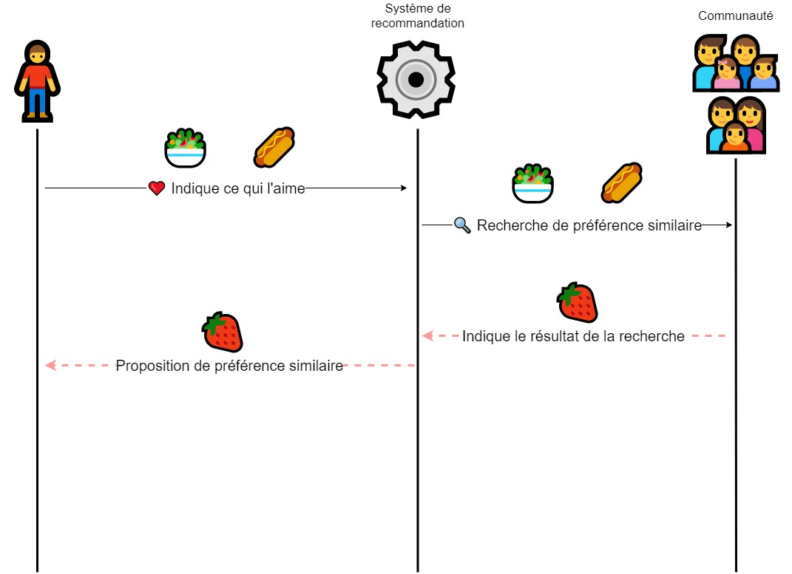

# Crea Code Club IA
## Partie 3: Saisir l'impacte sociétale

---

[//]: # (--------------- Introduction)

# Programme du cours
1. Biais algorithmique
2. Ne pas croire tout ce que l'on voit
3. Bulles de filtrage

---

# Biais Algorithmique

---

# Comment préparer une tartine ?
- Quels ingrédients mettez-vous dessus ?
- De quel façon mettez-vous les ingrédients ?
- Sucré ? Salé ? Gras ?
- Saine ?

---

# Les problèmes réels de ces biais
"[Reconaissance faciale: raciste et inefficace](https://www.youtube.com/watch?v=mkhES5pZrDA)"

---

# Qu'en pensez-vous ?

-   Que pensez-vous du taux d’erreur de ces systèmes ?
-   Que dire sur le fait que celui-ci augmente suivant vos origines ?
-   Pourquoi pensez-vous que c’est un problème ?
-   Pensez-vous qu’installer ce type de système serait une bonne idée ?

---

# Ne pas croire tout ce que l'on voit

---

# Faut-il toujours croire un son, une image ou une vidéo ?

---

# Voir n'est pas croire
**But**
*Éveiller l'esprit critique des étudiants face à du contenu médias (Vidéos, Sons, Photos)*

**Description de l'exercice**
L'exercice comprend une série de vidéos, sons et images. Certains sont bien réel, d'autre ont été fabriqué par des IA. Les étudiants doivent déterminer si il s'agit ou non de contenu générer par une IA

**Moyen**
- Par groupe de 2
- 20 min

---

# Que pensez-vous de ces technologies ? 
- Est-ce plutôt bien ou mal ? 
- Qu'en feriez-vous ?

---

# Bulles de filtrage

---

# Système de recommandation de musique

- Quelles musiques Spotify vous propose-t-il ?
- Avez-vous les mêmes recommandations que vos amis/proches ?

<!--  -->

---

*Fonctionnement d'un système de recommandation*

---

# Recommandation YouTube et bulle de filtrage

- Que se passe-t-il si l'on ne consomme que du contenu qui nous plaît ou pourrait nous plaire ?
- Que se passe-t-il du point de vue de l'esprit critique ?
- Quel est le problème de ne pas être confronté à d'autre point de vue ?

---

# Dans ma bulle
**But**
*Faire prendre conscience du nombre de système utilisant des système des filtrage pouvant potentiellement créer une bulle de filtre*

**Description de l'exercice**
L'exercice comprend une liste de système utilisant ou non un système de recommandation/filtrage. Les étudiants doivent trouver lesquels utilisent un système de recommandation et quelles sont les contenus recommandé par ceux-ci.

**Moyen**
- Par groupe de 2
- 20 min

---

# Comment s'en prémunir ?

- 🎭 Navigation internet en mode privé
- 🔍 Utiliser différent moteur de recherche (DuckDuckGo, StartPage, QWant)
- 🧐 Garder l'esprit critique
- 🧠 Rester ouvert d'esprit

<!--stackedit_data:
eyJoaXN0b3J5IjpbMTgzNTIyOTQ3N119
-->